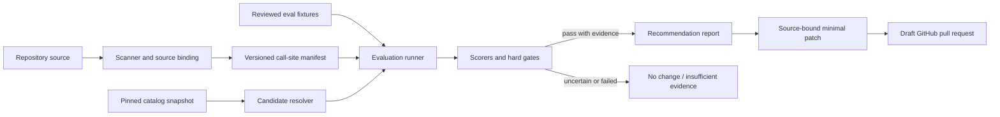

# Architecture

## Design goal

Vetryn is a repository-native change-control system for model pins. Its trusted core is a deterministic
pipeline whose inputs, decisions, and mutations are reviewable. Provider calls are side effects behind
adapters; GitHub is a delivery channel, not the source of truth.

## Components

### Domain core

Versioned schemas define call sites, source bindings, eval suites, catalog snapshots, candidate runs,
recommendations, and patch plans. The core has no provider, network, filesystem, AST, or GitHub
dependency. Rollout state is outside OSS V1.

### Scanner

Language adapters use syntax trees rather than regular expressions. A scanner may propose a call site
only when it can identify the SDK operation and an editable, static model literal. Each result includes
syntactic evidence, confidence, a patchability reason, and a source fingerprint used to prevent stale
patches. The scanner does not assign the human-owned stable call-site ID.

### Manifest

The repository owns the call-site manifest. It records source binding, owner, fixture, gates, and
provider constraints without storing credentials. Generated changes remain reviewable in Git.

### Candidate resolver and catalog

Catalog adapters normalize model capabilities, context limits, retirement state, provider, region, and
timestamped pricing. Every run pins its catalog snapshot so a result remains explainable after prices
or aliases change. Hard compatibility and repository policy filters run before shortlisting. V1 selects
at most five candidates by default, permits only a lower repository-configured bound, and uses stable
ordering with canonical model IDs as the final tie-breaker.

Live refresh computes a normalized catalog content digest. Unchanged content reuses the existing
immutable snapshot and records a separate immutable refresh observation containing source, time, and
content digest. A failed refresh is explicit and cannot make an older snapshot appear current. Historical
replay always uses its original snapshot.

### Evaluation runner

The runner executes current and candidate models over the same cases with controlled concurrency,
retries, seeds where supported, and redaction. It records raw measurements separately from derived
scores. Credentials come from the execution environment and outputs stay local by default.

### Scorers and gates

Deterministic assertions, domain checks, and statistical summaries produce V1 evidence. Hard policy
gates run before ranking. A cheaper candidate cannot compensate for a failed quality, privacy,
compatibility, context, or latency gate. LLM-as-judge scoring is explicitly deferred.
After V1 field validation, an optional calibrated semantic-rubric scorer may be designed only if
deterministic evaluation is shown to block valuable open-ended call sites; it cannot replace hard gates.

### Recommendation engine

The engine ranks only eligible candidates and may abstain. Recommendation artifacts include provenance,
confidence, limitations, failed cases, and reproduction commands.

### Patcher and GitHub integration

The patcher verifies the source fingerprint and changes only the bound literal. The GitHub integration
opens a draft PR from that patch, is idempotent per call site and candidate, and never merges or deploys.
Provider-backed assessment is manual by default. A repository may opt into a schedule, but unchanged
catalog and evaluation-input digests skip paid candidate execution only when prior evidence is complete,
integrity-valid, and reusable under current policy. Failed, partial, exhausted, privacy-unsafe, or
otherwise non-reusable evidence never suppresses a later bounded retry.

## Package direction

The initial monorepo keeps a small package graph and extracts adapters only when their implementation
milestone starts:

- `@vetryn/core`: provider-neutral schemas and decision primitives;
- `@vetryn/typescript`: AST discovery, source binding, fingerprints, and verified literal patching;
- `@vetryn/openrouter`: catalog normalization, compatibility, execution, pricing, and usage; and
- `vetryn`: end-user CLI, filesystem orchestration, reports, and the composite Action entry point.

The TypeScript and OpenRouter packages depend inward on the core. The CLI may compose all three. V1
uses a composite `action.yml` around the packaged CLI; an action package is created only if a substantial
independent boundary emerges.

## Trust boundaries

| Boundary                 | Rule                                                        |
| ------------------------ | ----------------------------------------------------------- |
| Repository → scanner     | Parse untrusted source without executing it                 |
| Fixtures → provider      | Show destination and require explicit credentials/policy    |
| Provider → evaluator     | Treat outputs and usage metadata as untrusted input         |
| Catalog → resolver       | Pin provenance and timestamps; do not trust mutable aliases |
| Recommendation → patcher | Require passed gates and a fresh source fingerprint         |
| Workflow → GitHub        | Use least-privilege permissions and draft PRs only          |

## Reproducibility and privacy

An evaluation run records tool version, commit, call-site manifest digest, fixture digest, catalog digest,
model identifiers, scorer configuration, sampling configuration, attempt count, and timestamps. Secrets
and unredacted fixtures are never written to reports. Remote telemetry is opt-in; OSS execution has no
mandatory control plane.
