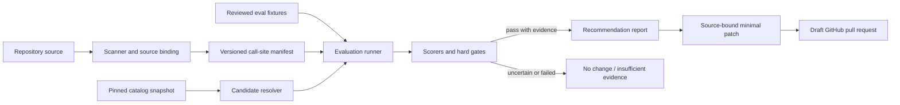

# Architecture

## Design goal

Vetryn is a repository-native change-control system for model pins. Its trusted core is a deterministic
pipeline whose inputs, decisions, and mutations are reviewable. Provider calls are side effects behind
adapters; GitHub is a delivery channel, not the source of truth.

## Components

### Domain core

Versioned schemas define call sites, source bindings, eval suites, catalog snapshots, candidate runs,
recommendations, and patch plans. The core has no provider, network, filesystem, AST, or GitHub
dependency. Rollout state is outside OSS V1.

The durable artifacts are strict JSON with `artifactType`, `schemaVersion`, and a deterministic artifact ID.
Canonical serialization sorts object keys and validates the artifact before writing it. The artifact boundary
contains only source metadata, opaque digests, aggregate measurements, safe identifiers, and bounded reason or
failure codes; raw prompts, raw outputs, credentials, provider error payloads, and source diffs are not fields
in these contracts.

| Artifact           | Durable responsibility                                                                              |
| ------------------ | --------------------------------------------------------------------------------------------------- |
| Call-site manifest | Human-owned identity, bound source, model pin, gates, route policy, capabilities, and usage profile |
| Eval suite         | Reviewed fixture reference, digest, case count, and redaction posture                               |
| Catalog snapshot   | Immutable model author, normalized capabilities, model-level pricing, and source provenance         |
| Candidate run      | Input digest, route policy and observation, paired metrics, gates, provenance, and failure state    |
| Recommendation     | Abstention or proposed source-bound model with a bound confidence floor and finite reason codes     |
| Patch plan         | One source-bound expected-model to replacement-model change bound to its recommendation             |

### Scanner

Language adapters use syntax trees rather than regular expressions. A scanner may propose a call site
only when it can identify the SDK operation and an editable, static model literal. Each result includes
syntactic evidence, confidence, a patchability reason, and a source fingerprint used to prevent stale
patches. The scanner does not assign the human-owned stable call-site ID.
Repository scan output also records a reconciled assessment funnel: supported TypeScript files considered,
successfully parsed, and parse-failed; total observations; disjoint patchable and non-patchable counts; disjoint
high-confidence and ambiguous counts; and reason-code totals. These units prevent a zero-finding scan from being
misreported as evidence that the repository has no AI usage.

### Manifest

The repository owns the call-site manifest. It records source binding, owner, fixture, gates, a strict OpenRouter
route policy, and a human-reviewed representative prompt/completion token-weight profile with provenance, without
storing credentials or raw traces. V1 route policy selects one reviewed provider slug, disables fallbacks, requires
parameter support, denies data collection, and requires ZDR. Generated changes remain reviewable in Git.

### Candidate resolver and catalog

Catalog adapters normalize model author namespaces, capabilities, context limits, retirement state, and timestamped
model-level pricing. The namespace before the first slash in an OpenRouter model ID identifies the author; it does
not identify the gateway endpoint or execution provider. Every run pins its catalog snapshot so a result remains
explainable after prices or aliases change. Hard compatibility filters run before shortlisting. V1 selects
at most five candidates by default and permits only a lower repository-configured bound. It ranks by
exact-decimal estimated workload cost, computed from normalized catalog prices and the manifest's pinned
prompt/completion token weights, ascending; then context limit descending; then canonical model ID
ascending. That number is explicitly a shortlist estimate, not observed provider billing. Missing, invalid,
unreviewed, or unprovenanced weights fail closed. The current baseline is recorded separately from the candidate
bound, and the shortlist carries the reviewed route policy separately from each candidate's author metadata.

Live refresh computes a SHA-256 digest over the canonical, model-ID-sorted normalized model list, and the
core rejects a snapshot whose declared digest does not match that content. Unchanged content reuses the existing
immutable snapshot and records a separate immutable refresh observation containing source, time, and
content digest. A failed refresh is explicit and cannot make an older snapshot appear current. Historical
replay always uses its original snapshot.

### Evaluation runner

The runner executes current and candidate models over the same cases with controlled concurrency, retries, seeds
where supported, and redaction. Every OpenRouter request is built from the call site's route policy. Complete runs
record that policy plus bounded router metadata for every observed attempt with exactly one selected successful
provider. Each request binds a case and evaluator repetition; complete runs cover that exact cross-product once,
while attempt ordinals independently identify router retries within a request. Missing, duplicated, or contradictory
metadata cannot support a recommendation. It records raw measurements separately from derived scores.
Credentials come from the execution environment and outputs stay local by default.

### Scorers and gates

Deterministic assertions, domain checks, and statistical summaries produce V1 evidence. Hard policy
gates run before ranking. A cheaper candidate cannot compensate for a failed quality, privacy,
compatibility, context, or latency gate. LLM-as-judge scoring is explicitly deferred.
After V1 field validation, an optional calibrated semantic-rubric scorer may be designed only if
positive sanitized evidence shows deterministic evaluation blocks valuable open-ended call sites. A
representative no-findings outcome requires a predeclared census and direct assessment of at least ten
eligible open-ended call sites across at least three FIELD-001 companies. No-findings or explicit
insufficient coverage satisfies the field-record criterion but cannot authorize expansion. A semantic
scorer cannot replace hard gates.

### Recommendation engine

The engine ranks only eligible candidates and may abstain. A recommend outcome requires every cited candidate
run to match the call site, baseline, catalog, candidate model, confidence floor, and evaluation-input digest,
with every hard gate passing and the recommendation confidence meeting that floor. An abstention retains the same
provenance bindings for any cited runs but may cite incomplete or failed runs to explain why no patch was produced.
The core derives measurable quality, cost, and latency gate outcomes from paired metrics and the call-site policy,
verifies that the proposed model is active, satisfies the call site's declared text-generation, structured-output,
and tool-call requirements, and has enough context in the bound snapshot. It binds every cited run to the call
site's declared reviewed eval-suite artifact, that suite's call site, fixture digest, and case count.
Recommendation artifacts include provenance, finite status-compatible reason codes, confidence, limitations,
failed cases, and structured allowlisted Vetryn reproduction operations. The durable limitation codes make report
caveats machine-readable, while the report renderer maps both limitation and reproduction fields to clear prose
and exact commands. A reviewed workload-volume profile with dated provenance enables estimated monthly and annual
economics from representative token weights and bound catalog pricing only while explicit policy derives it as
current. Its monthly request count is a positive integer no greater than 1,000,000,000,000; zero and any malformed,
fractional, unsafe, or oversized value fall back to normalized unit economics. The repository-owned recommendation
policy is digest-bound into the report and requires
`workloadVolumeMaxAgeDays` from 1 through 31, `catalogMaxAgeHours` from 1 through 168,
`evaluationMaxAgeHours` from 1 through 24, and `reportMaxAgeHours` from 1 through 24. The generator derives persisted
report `generatedAt` from an internal orchestration clock rather than report input, CLI flags, or Action inputs;
tests and offline replay may replace it only with a reviewed fixed clock. A recommendation report binds the current policy,
representative-usage profile, optional workload-volume profile or canonical absence, and immutable successful
catalog-refresh observation by digest or identity. The cited success is the terminal result of the current
invocation's ordered refresh attempts, or authenticated provenance commits the complete ordered lineage and proves
it is still the latest terminal attempt; a newer failure or omitted attempt fails closed. Generation and later patch or PR authorization re-evaluate all
required temporal evidence against their own trusted clock with at most five minutes of future skew; report,
catalog/pricing, and every cited evaluation run's completion time remain within their bounds. Actionable catalog
freshness comes only from live acquisition timed by the Vetryn runtime, a canonical persisted repository receipt,
or equivalent authenticated provenance;
caller-timestamped captures are replay-only. Each actionable run binds an immutable execution record whose times
come from the canonical runner's trusted clock, a canonical persisted repository receipt written by that runner, or
authenticated external provenance; arbitrary imports and caller-restamped runs are replay-only. Source fingerprint,
immutable fixture digest, evaluator identity, every cited run record,
successful refresh observation and committed catalog content, pricing, policy, and economic profile bindings must
exactly match the authorized inputs. An abstention report carries every available or rejected identity and a finite
reason for each unavailable required binding rather than manufacturing provenance. Any required temporal or identity failure prevents patch authorization. An
absent, invalid, or stale optional workload profile falls back to normalized unit economics without making an
otherwise valid recommendation abstain; missing required recommendation policy fails closed. Patch and PR
authorization never mutate the immutable recommendation. If its originally valid workload profile has expired, they
require a separately authenticated presentation revision binding the recommendation, original profile, fresh clock,
rejection reason, and normalized economics; the revision may only remove projections. Observed evaluation spend
remains separate.
Same-invocation evidence is actionable. For cross-invocation reuse, Vetryn authenticates each repository-log
extension with a key outside repository-controlled content and atomically advances an exact-head per-repository
anchor in the same locked transaction. Authorization requires all entries to verify and the repository head to equal
that anchor; append, deletion, truncation, fork, or rollback fails closed. A machine without the authenticated key
and anchor treats historical receipts as replay-only. A fresh run creates a new externally anchored trust epoch from
newly produced same-invocation receipts and never rehabilitates prior unanchored history. Report generation
canonicalizes a receipt-free payload first, then writes a detached receipt as a separate log entry binding the
payload digest, generator identity, original generated time, and decision inputs. The payload excludes the receipt
and its ID, preventing self-reference and restamping.
Projected workload economics never extrapolate observed eval-run spend. Catalog-bound projections, observed
evaluation spend, and later realized billing or runtime corroboration are three distinct evidence tiers.
Savings percentage is a 0-to-10,000 integer basis-point value derived with exact rational arithmetic and half-up
rounding; Markdown renders the same value with two decimal places. Zero-current-cost and non-saving comparisons use
finite unavailable reasons rather than division, infinity, or a negative percentage.

### Patcher and GitHub integration

The patcher verifies that the patch plan exactly matches its recommendation and source fingerprint, then changes
only the bound literal. The GitHub integration
opens a draft PR from that patch, is idempotent per call site and candidate, and never merges or deploys.
The PR renderer appends a deterministic next action derived from the reconciled assessed-surface funnel, such as
reviewing another eligible call site, and explicitly reports that none is available when the reconciled count is
zero. This presentation metadata cannot affect recommendation or patch eligibility.
Provider-backed assessment is manual by default. A repository may opt into a schedule, but unchanged
catalog and evaluation-input digests skip paid candidate execution only when prior evidence is complete,
integrity-valid, and reusable under current policy. The evaluation-input digest includes the evaluator
executable identity, so a tool version or build/commit revision change invalidates reuse. Failed, partial,
exhausted, privacy-unsafe, or otherwise non-reusable evidence never suppresses a later bounded retry.

Consumer activation uses one documented `vetryn assess` orchestration command after a reviewed manifest and eval
suite exist. The composite Action invokes the same path and adds draft-PR creation only in an explicit
GitHub-enabled mode. Root `llms.txt`, Markdown instructions, stable JSON, and documented exit semantics expose the
same provider-neutral contract to Codex, Claude, and other coding agents without requiring a hosted control plane
or agent-specific runtime integration. Both paths validate the required recommendation policy and other
deterministic prerequisites before any provider call; missing or malformed required policy abstains without provider
spend.

## Package direction

The initial monorepo keeps a small package graph and extracts adapters only when their implementation
milestone starts:

- `@vetryn/core`: provider-neutral schemas and decision primitives;
- `@vetryn/typescript`: AST discovery, source binding, fingerprints, and verified literal patching;
- `@vetryn/openrouter`: catalog normalization, compatibility, execution, pricing, and usage; and
- `vetryn`: end-user CLI, filesystem orchestration, reports, and the composite Action entry point.

The TypeScript and OpenRouter packages depend inward on the core. The CLI may compose all three. V1
uses a composite `action.yml` around the packaged CLI; an action package is created only if a substantial
independent boundary emerges.

## Trust boundaries

| Boundary                 | Rule                                                                              |
| ------------------------ | --------------------------------------------------------------------------------- |
| Repository → scanner     | Parse untrusted source without executing it                                       |
| Fixtures → route         | Show the reviewed route and require explicit credentials/policy                   |
| Router → evaluator       | Treat outputs, usage, attempts, and selected-provider metadata as untrusted input |
| Catalog → resolver       | Pin provenance and timestamps; do not trust mutable aliases                       |
| Recommendation → patcher | Require passed gates and a fresh source fingerprint                               |
| Workflow → GitHub        | Use least-privilege permissions and draft PRs only                                |

## Reproducibility and privacy

An evaluation run records tool version, build or commit revision, call-site manifest digest, fixture
digest, catalog digest, model author identifiers, route policy, router attempts and selected provider, scorer configuration, sampling configuration and seed, attempt count,
timestamps, and aggregate variance. The evaluation-input digest binds that evaluator executable identity with the
remaining inputs. Secrets and unredacted fixtures are never written to reports. Remote telemetry is opt-in; OSS
execution has no mandatory control plane.
