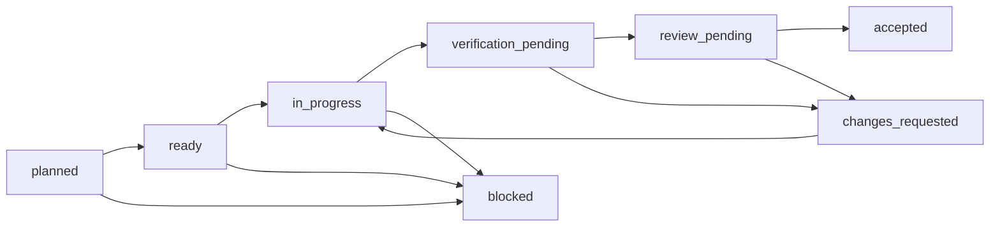

# OSS V1 execution system

This document explains how humans and coding agents execute the canonical plan in
`product/plans/oss-v1/plan.json`. It is an operating contract, not a second backlog.

## Sources of truth

| Question                                     | Source                                                    |
| -------------------------------------------- | --------------------------------------------------------- |
| What is the V1 product?                      | `docs/oss-v1.md`                                          |
| Why are the boundaries locked?               | `docs/adr/0002-lock-oss-v1-scope.md`                      |
| What can run next?                           | `product/plans/oss-v1/plan.json` plus `state/*.json`      |
| What proves completion?                      | `acceptance-ledger.json` plus immutable `evidence/*.json` |
| What is current progress?                    | generated `progress.json`                                 |
| What does the real workflow have to survive? | `examples/openrouter-typescript/fixtures/scenarios.json`  |

`ROADMAP.md` remains a human summary. It must not be used to infer task readiness or acceptance.

## Task lifecycle

A task is ready only when every hard, contract, or field dependency is accepted. An executor may submit a
candidate and evidence but cannot accept its own task. An independent verifier runs the declared
gates; the trust reviewer checks abstention, patch safety, privacy, and evidence sufficiency. Two
failed attempts with the same failure fingerprint stop automatic repair and require maintainer triage.

## Agent roles and handoff

Run `pnpm --silent task:next` to inspect active and legal work, then
`pnpm --silent task:compile -- TASK-ID` to produce the deterministic task packet bound to the product contract,
plan, ledger, task state, and lockfile. The compiler fails closed if the canonical plan is stale or the task is
not executable. The full repository lifecycle is in `WORKFLOW.md`.

1. **Planner** selects a ready task, confirms locked decisions and scope, and creates a bounded task
   brief from the canonical JSON.
2. **Executor** implements only allowed paths, runs the smallest relevant tests, and records the
   candidate commit and command evidence.
3. **Independent verifier** reruns every required gate from the candidate commit and checks evidence
   digests. The verifier must not be the executor.
4. **Trust reviewer** reviews high-risk semantics: no patch on ambiguity, stale source, insufficient
   evidence, compatibility failure, privacy risk, or hard-limit failure.
5. **Maintainer** accepts, requests changes, or records an explicit waiver where the ledger allows it.

Agents should work on one task per branch/PR. Parallel work is permitted only when the DAG allows it
and paths do not overlap. A task brief is disposable; canonical state and evidence are committed.

Ordinary role approval requires a distinct CODEOWNER's current exact-candidate GitHub review. During the
single-owner ADR-0006 bootstrap only, the repository owner may instead use the exact structured PR issue-comment
marker documented in `WORKFLOW.md`, including when that owner authored the PR. The validator authenticates the
comment's current body, ID, URL, repository, PR, task, candidate, decision, named roles, and exact public
association provenance (`OWNER`, `MEMBER`, or `CONTRIBUTOR`). Protected-main CODEOWNERS, not that association,
authorizes the actor for each role. This does not replace independent agent verification, CI, Codex settlement,
merge authorization, or canonical promotion.

## Runner-ready task packet

The compiler preserves Vetryn's canonical `source`, `task`, state, acceptance, gate, review, and execution
objects and adds the explicit snake-case fields consumed by Factory's `task-executor`. Those fields name the
task and risk, allowed and forbidden paths, scope exclusions, baseline/red-first/focused/final commands, worker
chain, lifecycle gates, retry budget, runtime pins, Factory compatibility, policy references, documentation and
release intent, and item-level acceptance-result requirements.

`evidence_required` and `worker_evidence_required` contain only evidence the executor can produce before
shipping. `lifecycle_evidence_required` names the real outputs produced later by `validation-gate`, `commit-push`,
and Vetryn's specialized verify/promote roles: validation, authenticated GitHub review, ship packet, pull-request
lifecycle, post-merge, and canonical-promotion evidence. Factoryd-only scope-closure artifacts are not required
while Factoryd remains deferred. An executor may report an acceptance item as implemented, partial, missing, or
blocked, but that result does not change the ledger, accept the task, or satisfy a pending review. Any source
digest or plan drift requires recompilation before handoff.

## Quality lanes

| Lane               | Purpose                                                      | Merge policy                                       |
| ------------------ | ------------------------------------------------------------ | -------------------------------------------------- |
| Static             | format, lint, dead code, types, build                        | required                                           |
| Unit/property      | schema logic, scoring, limits, normalization                 | required when applicable                           |
| Contract           | CLI JSON, manifests, catalog, run and recommendation schemas | required when introduced                           |
| Scanner corpus     | precision/recall over supported and ambiguous syntax         | required for scanner changes                       |
| Golden offline E2E | scan → eval → recommend → patch → rerun                      | required once implemented                          |
| Pack smoke         | install packed CLI packages in a clean fixture               | required                                           |
| Field              | trusted-main OpenRouter run with explicit budget             | manual or explicitly scheduled, never a merge gate |

The CI fan-in job must fail if a required lane is missing, skipped unexpectedly, or failed. Live model
availability and provider responses are not reproducible enough to gate pull requests.

## Scenario policy

The golden example covers the economic win and the trust failures. Unknown, ambiguous, stale,
incompatible, privacy-sensitive, budget-exhausted, and insufficient-evidence states always fail closed.
Snapshots complement semantic assertions; they never replace them. Every replay pins the catalog,
provider responses, case set, scorer configuration, policy, and clock.

The later field gate requires at least ten qualified recommendation PRs across three companies, at
least 40% merged within fourteen days, and zero serious quality, safety, privacy, or operational
regressions. It validates the product thesis; it does not weaken per-PR correctness gates.

## Factory integration stance

V1 does not add Factory as a git submodule. The reusable interface is the checked-in plan, state,
ledger, evidence, and progress schemas. `.factory/profile.yaml` is a thin local policy profile, while
`.factoryd/` is ignored transient runtime state. Factory can later consume these artifacts externally;
Factoryd is deferred until it supports the TypeScript package graph without inheriting a Go-specific
bootstrap contract.

The repository-local `$vetryn-implement-task`, `$vetryn-verify-task`, and `$vetryn-promote-task` skills
specialize the task lifecycle. They deliberately reuse Factory's universal execution, validation, review,
and shipping skills instead of copying them into this repository.
