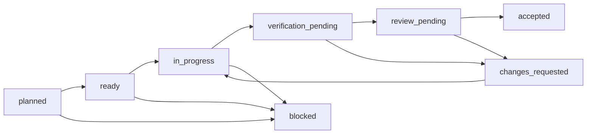

# OSS V1 execution system

This document explains how humans and coding agents execute the canonical plan in
`product/plans/oss-v1/plan.json`. It is an operating contract, not a second backlog.

## Sources of truth

| Question                                     | Source                                                    |
| -------------------------------------------- | --------------------------------------------------------- |
| What is the V1 product?                      | `docs/oss-v1.md`                                          |
| Why are the boundaries locked?               | `docs/adr/0002-lock-oss-v1-scope.md`                      |
| What can run next?                           | `product/plans/oss-v1/plan.json` plus `state/*.json`      |
| What proves completion?                      | `acceptance-ledger.json` plus immutable `evidence/*.json` |
| What is current progress?                    | generated `progress.json`                                 |
| What does the real workflow have to survive? | `examples/openrouter-typescript/fixtures/scenarios.json`  |

`ROADMAP.md` remains a human summary. It must not be used to infer task readiness or acceptance.

## Task lifecycle

A task is ready only when every hard, contract, or field dependency is accepted. An executor may submit a
candidate and evidence but cannot accept its own task. During the ADR-0009 maintainer-led V1 mode, an active
maintainer from `MAINTAINERS.md` promotes an exact candidate after its active command gates pass. Named human reviewer records remain
advisory. A high-risk packet's candidate-bound local structured review is a required process gate, and
`QG-TRUST-REVIEW` invokes the repository's domain-specific semantic review. Two failed attempts with the same
failure fingerprint stop automatic repair and require maintainer triage.

## Agent roles and handoff

Run `pnpm --silent task:next` to inspect active and legal work, then
`pnpm --silent task:compile -- TASK-ID` to produce the deterministic task packet bound to the product contract,
plan, ledger, task state, and lockfile. The compiler fails closed if the canonical plan is stale or the task is
not executable. The full repository lifecycle is in `WORKFLOW.md`.

1. **Planner** selects a ready task, confirms locked decisions and scope, and creates a bounded task
   brief from the canonical JSON.
2. **Executor** implements only allowed paths, runs the smallest relevant tests, and records the
   candidate commit and command evidence.
3. **Verifier** independently reruns active gates when available and checks candidate binding, redaction, and
   scope. It does not repair or promote the candidate.
4. **Trust reviewer** reviews high-risk semantics when `QG-TRUST-REVIEW` is active: no patch on
   ambiguity, stale source, insufficient evidence, compatibility failure, privacy risk, or hard-limit failure.
5. **Maintainer** accepts, requests changes, or records an explicit waiver where the ledger allows it.

Agents should work on one task per branch/PR. Parallel work is permitted only when the DAG allows it
and paths do not overlap. A task brief is disposable; canonical state and evidence are committed.

ADR 0009 makes named reviewer records and `CODEOWNERS` advisory for the OSS V1 build. Explicit task-scoped
approval from any active maintainer plus exact-candidate command evidence controls promotion. High-risk work also requires a frozen-candidate
Factory `code-review` report after validation, and an active `QG-TRUST-REVIEW` requires the Vetryn semantic review.
Neither report substitutes for CI or deterministic command evidence.

## Runner-ready task packet

The compiler preserves Vetryn's canonical `source`, `task`, state, acceptance, gate, review, and execution
objects and adds the explicit snake-case fields consumed by Factory's `task-executor`. Those fields name the
task and risk, allowed and forbidden paths, scope exclusions, baseline/red-first/focused/final commands, worker
chain, lifecycle gates, retry budget, runtime pins, Factory compatibility, policy references, documentation and
release intent, and item-level acceptance-result requirements.

For medium- and high-risk work, the packet requires `semantic_risk_report_ref` and
`semantic_risk_integrity_marker_ref` at two task-bound targets under `.factory/artifacts/task-runs/`. The agent
authors only the report body in ignored `.factory/tmp/`; `pnpm --silent semantic-risk:design -- TASK-ID`
requires a clean candidate snapshot, derives repository metadata, validates the byte-pinned Factory schema, and
writes the report and content-bound integrity marker atomically per file. Prefer this design pass before product
editing, but do not treat its repository-owned marker as authenticated chronology, approval, or execution authority.
A partial pair remains fail closed. Bound-candidate packet
validation then reads both artifacts from the exact candidate blobs and checks schema, digests, task/risk/profile
identity, source ancestry, and review convergence. The V1 repo-native adapter deliberately rejects every
`authorized` external action: offline tasks use only `blocked` or `not_applicable`, and live authority remains a
separately designed field-operation boundary. The two exact targets are appended to runner `allowed_paths` without
changing canonical product scope.

`required_worker_chain` names generic Factory workers. `required_domain_review_chain` separately names the
repository skill required by an active domain gate; `QG-TRUST-REVIEW` therefore emits `vetryn-trust-review`, sets
`trust_review_required`, and requires a candidate-bound `trust_review_report`. A generic code review cannot satisfy
that semantic gate.

Tasks that add or change publishable workspace packages must explicitly include `.changeset/**` and every root
workspace file they need. Their compiled packets require release metadata, a semver marker, and package-facing
documentation sync; package-local scope alone is not sufficient evidence for a clean frozen install or release.

`evidence_required` and `worker_evidence_required` contain only evidence the executor can produce before
shipping. `lifecycle_evidence_required` names the outputs produced later by `validation-gate`, `code-review`,
`commit-push`, and Vetryn's specialized promote role: validation, high-risk structured review, shipping,
pull-request lifecycle, post-merge, and canonical promotion evidence. Factoryd-only scope-closure artifacts are
not required while Factoryd remains deferred. `lifecycle_evidence_refs` maps every required output to one
deterministic JSON path under `product/plans/oss-v1/evidence/lifecycle/<task-id>/<candidate-commit>/`; an initial
packet uses `unbound` and cannot supply lifecycle evidence until the candidate is frozen and the packet is
recompiled. Those artifacts are lifecycle-owned and remain outside the executor's allowed paths. An
executor may report an acceptance item as implemented, partial, missing, or blocked, but that result does not
change the ledger or accept the task. Any source drift requires recompilation; plan and lockfile digests in
already-passing evidence remain immutable historical provenance.

Before consuming lifecycle evidence from a stored packet, replace `{packet_path}` in the packet's declared command
and run `node scripts/task.mjs validate <packet-path>`. The command applies the public JSON Schema, validates the
canonical repository plan and ledger before using them, authenticates the current product-contract, plan, and
lockfile inputs, re-derives task risk and lifecycle gates from canonical
policy, binds the candidate to canonical state, and then recomputes each lifecycle ref. It rejects policy
downgrade, cross-plan or cross-task packet identity, stale-candidate, unbound-candidate, swapped-artifact, and
security-input drift while
allowing ledger/status-only promotion tails that preserve the frozen candidate. The canonical comparison includes
executor evidence, item-level acceptance closure, commands, scope exclusions, stop conditions, retry/runtime pins,
Factory compatibility, execution permissions, lifecycle policy, acceptance-item policy, scanner/CI gates,
release/documentation intent, and source metadata. Only packet revision, lifecycle state label, and ledger/state
status-evidence bytes may differ as a promotion tail while the candidate remains exact.
Canonical objects use structural equality: object member order is irrelevant, but array order remains part of the
contract.
The packet's immutable digest map contains the product contract, plan, lockfile, portable Factory profile, and both
vendored semantic-risk schemas. The v0.1 schema is retained because v0.2 references its stable field definitions.
The profile pins the canonical Factory commit and digests for `profiles/vetryn.yaml` and both byte-identical schema
files. It also pins the manifest digest for each installed portable worker in one immutable pack set. Profile,
schema, or manifest-pin drift invalidates an active packet. The continuation bootstrap separately authenticates
committed profile bytes, manifest pins, complete pack resources, and verifier bytes before it executes an installed
verifier. Pack-set v1 is intentionally limited to POSIX macOS and Linux with `/dev/fd`; unsupported platforms fail
with a stable blocker before installed-pack I/O and do not fall back to named-path execution.
Ledger and task-state
paths remain explicit canonical inputs whose current contracts are validated directly. An acceptance item may
carry either the exact current ledger tail or an empty `planned` tail frozen before a canonical `accepted`
promotion; invented status or evidence references and blocked or deferred canonical outcomes hidden behind a stale
planned tail fail preflight.
For a frozen candidate, immutable inputs are read from the candidate's Git tree. Product-contract and lockfile
bytes must also equal the current checkout. The plan digest remains bound to the candidate while the validator
compares packet-bearing plan identity, baseline repository and commit, and product-contract path with the candidate
plan; re-derives this task's complete policy from the valid current plan; and compares the current task and gate
definitions with the candidate plan and policy-bearing acceptance fields with the candidate ledger before packet
emission. Unrelated task edits preserve historical evidence, but relevant source metadata, plan, or
acceptance-policy drift fails validation and recompilation. A blocked, failed, or superseded canonical state—or any
active blocker—halts preflight regardless of the packet's historical state label.

## Quality lanes

| Lane               | Purpose                                                      | Merge policy                                       |
| ------------------ | ------------------------------------------------------------ | -------------------------------------------------- |
| Static             | format, lint, dead code, types, build                        | required                                           |
| Unit/property      | schema logic, scoring, limits, normalization                 | required when applicable                           |
| Contract           | CLI JSON, manifests, catalog, run and recommendation schemas | required when introduced                           |
| Scanner corpus     | precision/recall over supported and ambiguous syntax         | required for scanner changes                       |
| Golden offline E2E | scan → eval → recommend → patch → rerun                      | required once implemented                          |
| Pack smoke         | install packed CLI packages in a clean fixture               | required                                           |
| Field              | trusted-main OpenRouter run with explicit budget             | manual or explicitly scheduled, never a merge gate |

The CI fan-in job must fail if a required lane is missing, skipped unexpectedly, or failed. Live model
availability and provider responses are not reproducible enough to gate pull requests.

`pnpm test:scanner-corpus` and `pnpm test:scenarios` each select only their named future suite. Until the
corresponding task adds that suite, the command intentionally fails rather than allowing the generic unit suite to
stand in for required evidence.

## Scenario policy

The golden example covers the economic win and the trust failures. Unknown, ambiguous, stale,
incompatible, privacy-sensitive, budget-exhausted, and insufficient-evidence states always fail closed.
Snapshots complement semantic assertions; they never replace them. Every replay pins the catalog,
provider responses, case set, scorer configuration, policy, and clock.

The later field gate requires at least ten qualified recommendation PRs across three companies, at
least 40% merged within fourteen days, and zero serious quality, safety, privacy, or operational
regressions. It validates the product thesis; it does not weaken per-PR correctness gates.

## Portable continuation and Factory integration

V1 does not add Factory as a git submodule or require it as a sibling checkout. The reusable interface is the
checked-in plan, state, ledger, evidence, progress schemas, and self-contained portable-worker
`.factory/profile.yaml`; `.factoryd/` is ignored transient runtime state. Installed portable Factory packs are usable only when the committed profile pins
their source and exact manifests and the repository-owned bootstrap verifies the complete closure. Factoryd remains
deferred until it supports the TypeScript package graph without inheriting a Go-specific bootstrap contract.

The explicit `vetryn-continue-next` skill runs a shell-free, mutation-checked offline preflight. It derives the
repository root, default branch, exactly one active-or-next task, compiled packet, capabilities, required skills,
commands, reviews, promotion rules, and protected delivery lifecycle from committed repository state. It executes
plan check, task selection, and task compilation twice for determinism and compares HEAD, branch, refs, index,
status including ignored and untracked content, local configuration, remotes, canonical inputs, and the worktree
before and after. Stable JSON contains no absolute path, remote URL, credential, or user identity.

`ready_for_authority` means the offline inputs were coherent and unchanged. It does not authenticate a maintainer,
prove server freshness, or authorize a branch, edit, promotion, GitHub write, merge, credential, or provider call.
Those effects require a separately authenticated grant from a current listed maintainer for the exact run, task,
packet, and actions. See ADR 0022.

Continuation resumes only canonical `in_progress` work with `candidate: null` on a clean non-default branch that
descends from synchronized local/remote main and whose committed diff remains inside packet scope. Candidate-bound,
verification, review, and changes-requested phases fail closed until a separate lifecycle-tail contract defines
which later commits may follow a frozen candidate without using a self-referential SHA.

The repository-local `$vetryn-implement-task`, `$vetryn-verify-task`, `$vetryn-promote-task`, and
`$vetryn-trust-review` skills specialize the task lifecycle. The trust skill activates for V1-06 and later
evaluation, recommendation, and patch work when `QG-TRUST-REVIEW` is declared. They deliberately reuse Factory's
universal execution, validation, structured review, and shipping skills instead of copying them into this
repository.
